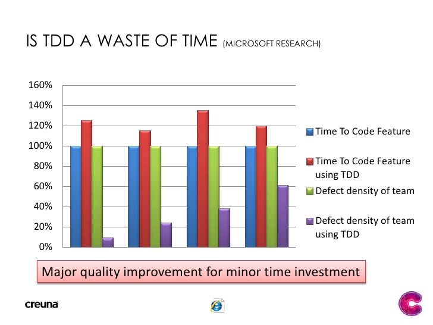

# Test-Driven Development

Test-driven development is an evolutionary approach to development which combines test-first development where you 
write a test before you write just enough production code to fulfill that test and refactoring. TDD is risk averse 
programming, investing work in the near term to avoid failures later on.

### What is wrong with test-last approach?

Tests are often considered as the boring part of software development what brings no value. Because of this tests are 
usually written at the end of the development cycle, with poor quality. Many times tests are written by other developers
who are not that familiar with the feature what needs to be tested. Developers will move to other projects, the tests are
not reliable having poor coverage and this will lead to situations when bug-fixes are creating other issues. Even worse
when issues come to surface in production. Developers will be afraid to touch legacy code or to extend existing functionalities.
Projects with poor tests or without tests often end up looking like they are stuck together with duct tape. Change one 
part and the other part stops working.

In the picture below you can see that the price of fixing a defect is increasing exponentially with the lifecycle phase
where the problem is discovered. 

The biggest chance to create a bug is at the coding phase, when it is cheap to fix. 
Later it gets harder to fix, because it takes more effort to understand the problem, reproduce, fix and test it.
Bugs are not only wasting developers time, but it also hurts the company’s brand and quality reputation. 
For developers context switching can cost up to 20 minutes per bug (doing nothing productive) and then recover the 
context of the problem they were working on prior to the interruption.

### Why should you do TDD?

People think that TDD is only about writing tests before writing production code. The reality is that TDD is not only a
testing technique, but also a software design technique. When you have to write tests you are forced to think about 
"how to use" the feature, rather than "how to implement".

TDD encourages the developer to split the task to small portions and write only as much production code as needed. This 
will let you know when are you finished, and will stop you implement unneeded functionalities (YAGNI). Tests must be able 
to ensure a fast feedback loop. Hundreds of tests must run within a second, what will encourage developers to run tests 
after every change, and let them know as soon as possible if a change has unwanted effect on an already existing feature 
(creates new defect). This will also help people writing readable code by refactoring and to introduce new changes.

“A significant advantage of TDD is that it enables you to take small steps when writing software. This is a practice 
that I have promoted for years because it is far more productive than attempting to code in large steps.” (Kent Beck)

Tests are also considered as a living documentation of the product, what stays in sync with the ever changing production 
code. They will help newcomers to understand the functionalities of the product.

Writing tests first will help to write simple, loosely coupled, flexible and maintainable code. It improves the overall
code quality and helps the creation of a well designed software.

Many design issues and code smells are coming to surface only when tests are written. If it is hard to test something 
that is a sign that your code smells.

“If the answer is not obvious, or it looks like the test would be ugly or hard to write, then take that as a warning 
signal. Your design probably needs to be modified; change things around until the code is easy to test, and your design 
will end up being far better for the effort.” (Thomas Hunt)

Here is a list of the most relevant code smells what could be avoided by using TDD:
 - constructor/method/class does too much work (violating Single Responsibility Principle)
 - instantiation by using `new` keyword (hard-coded dependencies)
 - anything more than field assignment in constructor
 - too many fields / too many dependencies
 - class has fields used only in some methods
 - excessive scrolling
 - high maintenance cost
 - no / meaningless asserts in tests
 - testing private / protected methods
 - extensive setup / teardown
 - brittle tests
 - slow tests

##### TDD challenges
  
People think TDD results a much slower development process. This is not true. It takes more time to develop a feature, 
but it reduce significantly the defect rate, and helps the debugging process, saving the time and effort in a later phase 
of development.
  

Management doesn't often understand "internal quality" so it's hard to make them understand why should they support TDD. 
On the other hand the business team doesn't care at all about the development process you use, as long as it’s effective. 
TDD might also look more expensive than traditional development, but it pays off on a long term.

Developers are often stubborn and lazy to drop bad habits, but TDD brings professionalism to software development, since 
it requires discipline.

Here are the top 5 excuses (and the truth) for not unit testing or doing TDD:
 1. "I don’t have time to unit test" (You will need to spend your time to debug and fix defects)
 2. "The client pays me to develop code, not write unit test" (The client pays you to deliver working product)
 3. "I am supporting a legacy application without unit tests" (You will be afraid to improve/change it without tests)
 4. "QA and User Acceptance Testing is far more effective in finding bugs" (It is rather more costly and time consuming)
 5. "I don’t know how to unit test, or I don’t know how to write good unit tests" (Learn it!)

#### How to learn TDD?

TDD is about developing new habits, what could be hard but worth the effort.

“I’m not a great programmer; I’m just a good programmer with great habits” (Kent Beck)

This is the recommended process to develop something by using TDD:
 1. Check if all current tests are passing
 2. Do up-front design and list new tests
 3. Implement one (failing) test at a time (Red)
 4. Implement just enough code to pass (Green)
 5. Refactor the code and clean up design (Refactor)
 6. Repeat until all tests are passing

When you start to learn TDD you should do 30 minutes of Coding Kata or Coding Dojo every day for 2 weeks. Dojo is a bit 
better because pair programming could help you to stay on track and to learn the process. The purpose of the Coding Kata 
is NOT(!) to solve the coding problem, but rather to learn the process and stick to the Red-Green-Refactor steps.

You should familiarize yourself with baby steps. You should do small, simple changes one at a time. It is allowed to return
simple values at the beginning, even hard-coded ones. Later you could add more conditions, or change the logic if it is
hard to keep up with the new test conditions. Always refactor!
    
During the process you should learn different types of testing techniques and how to write good tests. 

#### A short note on testing

There are many test types, but here are the most important ones:

 * unit tests:
   - shows that individual parts (units) work correctly in isolation
   - fast and reliable
   - everything done in-memory
   - most dependencies are mocked
   - covers most of your codebase
   - use for development and refactoring
   
 * integration tests:
   - individual modules are tested as a group
   - verifies the communication paths and integrations between components
   - much slower and more complicated to set-up and debug

 * functional or acceptance tests:
   - checks a particular feature for correctness
   - internal program structures are rarely considered
   - nothing is mocked
   - very hard to create and maintain, runs very slow

As you could see, unit tests are at the bottom of the test pyramid. This means you must have tons of unit tests running 
very fast. They are good to assure unit functionalities, but they are not good fit to assure product functionalities. 
For this you will need higher order tests, what are at the top of the pyramid. This means they are costly to create and 
maintain. They also need more time to run (could be minutes), so you should have less of them.

Here are some hints how to write good tests:
 - use test doubles like stubs or mocks (they help you remove external dependencies, to focus on a specific code path, 
 and to create known state)
 - use black-box testing (your tests will be more tolerant to change when they don't depend on implementation details)
 - the name should clearly describe the purpose of the test
 - each test should be for a single concept
 - use data that makes them easy to read and to understand
 - use Given/When/Then format:
   - Given or Arrange: the state of the application in order for the scenario to run successfully
   - When or Act: the action that has to be completed in the current scenario
   - Then or Assert: the acceptance criteria that the scenario uses in order to ensure success
 - make it FIRST:
   - **F**ast: you should be able to run them after every change, so all of them must run in less than a second
   - **I**ndependent: should run in any order and should not depend on other tests
   - **R**epeatable: should be always running on every environment
   - **S**elf-validating: should indicate clear success or failure without the need of further investigation
   - **T**imely: should be written before production code to help the code design

#### A short note on eXtreme Programming

Acceptance Test-Driven Development is a development methodology based on communication between the business customers, 
the developers, and the testers. In fact it is TDD at product level.

The ATDD process contains the following steps:
 - discuss requirements, create examples, write user stories
 - distill examples into acceptance tests
 - develop features, hook up tests
 - demo features and acceptance tests

eXtreme Programming is a software development methodology which is intended to improve software quality and responsiveness 
to changing customer requirements.

XP was created by Kent Beck (the father of TDD) and it is based on the following techniques:
 - TDD and ATDD
 - pair programming
 - incremental design
 - simplicity (YAGNI)
 - clean code
 - continuous integration
 - frequent small releases
 - embracing change
 - shared understanding (ATDD)

In short, XP is about:
 - writing great code
 - improving skills and giving up bad habits
 - keeping the costs of change low

 
 

Forming habits is hard. Replacing bad habits are the hardest. Clean Code and TDD are your friends at work, so make them 
a habit, not a choice.

 

### Recommended readings

 - [Kent Beck - Test Driven Development: By Example](https://www.amazon.com/Test-Driven-Development-Kent-Beck/dp/0321146530)
 - https://martinfowler.com/articles/microservice-testing
 - https://www.slideshare.net/lemiorhan/the-engines-of-software-development-testing-and-test-driven-development/  
 - https://www.slideshare.net/guestc8093a6/test-driven-development-1000421
 - https://www.slideshare.net/haochenglee/test-driven-developmentcontinuousintegration
 - https://www.slideshare.net/baronslideshare/testdriven-development-tdd
 - https://www.slideshare.net/ehendrickson/introduction-to-acceptance-test-driven-development-3491703
